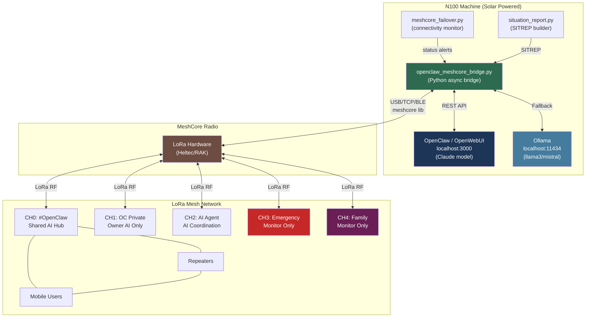

# OpenClaw + MeshCore System Block Diagram

## Full System Architecture

```
+------------------------------------------------------------------+
|                        N100 MACHINE                              |
|                   (Solar Powered Home Server)                    |
|                                                                  |
|  +------------------+        +-----------------------------+     |
|  |   OpenClaw /     |        |  openclaw_meshcore_bridge   |     |
|  |   OpenWebUI      |<------>|  .py (Python async bridge)  |     |
|  |   localhost:3000 |  REST  |                             |     |
|  |   (Claude model) |  API   |  - Channel msg handler      |     |
|  +------------------+        |  - DM handler               |     |
|          |                   |  - AI reply chunker         |     |
|          | fallback          |  - Heartbeat (5 min)        |     |
|          v                   |  - Boot announcer           |     |
|  +------------------+        |  - Monitor-only channels    |     |
|  |   Ollama         |<------>|                             |     |
|  |   localhost:11434|        +-------------+---------------+     |
|  |   llama3/mistral |                      |                     |
|  +------------------+                      | meshcore            |
|                                            | Python lib          |
|  +------------------+                      | (pip install        |
|  | meshcore_failover|                      |  meshcore)          |
|  | .py              |                      |                     |
|  | (ISP monitor)    |                      |                     |
|  +------------------+                      |                     |
|                                            |                     |
|  +------------------+                      |                     |
|  | situation_report |                      |                     |
|  | .py (SITREP)     |                      |                     |
|  +------------------+                      |                     |
|                                            |                     |
+-------------------------------------------+---------------------+
                                            |
                              USB / TCP / BLE
                                            |
                               +------------+------------+
                               |  MeshCore LoRa Radio    |
                               |  (Companion Firmware)   |
                               |  Heltec / RAK / etc.    |
                               +------------+------------+
                                            |
                                     LoRa RF Signal
                                            |
              +-----------------------------+-----------------------------+
              |                             |                             |
   +----------+----------+      +----------+----------+      +-----------+----------+
   |  MeshCore Repeater  |      |  Other LoRa Nodes   |      |  Mobile App Users    |
   |  (mesh extension)   |      |  (AI agents, etc.)  |      |  (Android/iOS/Web)   |
   +---------------------+      +---------------------+      +----------------------+
```

---

## Message Flow — Inbound (Someone Messages OpenClaw via LoRa)

```
[Remote LoRa Node]
       |
       | LoRa RF (OC-ACL or plain text)
       v
[MeshCore Radio Hardware]
       |
       | USB/TCP/BLE serial protocol
       v
[meshcore Python library]  <-- EventType.CHANNEL_MSG_RECV or CONTACT_MSG_RECV
       |
       v
[openclaw_meshcore_bridge.py]
       |
       +-- Is it Emergency (CH3) or Family (CH4)?
       |         YES --> Log only, no reply
       |
       +-- Is it #OpenClaw (CH0), Private (CH1), or AI Agent (CH2)?
                 YES -->
                         |
                         v
               [ask_openclaw(prompt, system)]
                         |
                         +-- Try OpenWebUI/OpenClaw localhost:3000
                         |        SUCCESS --> return AI response
                         |
                         +-- Fallback: Ollama localhost:11434
                                  SUCCESS --> return local AI response
                                  FAIL --> "[CLAW] AI unavailable"
                         |
                         v
               [chunk_message(response)]
               Split into <=133 char packets
               with [1/N] numbering
                         |
                         v
               [meshcore.commands.send_chan_msg(channel_idx, chunk)]
               Send each chunk back to same channel
```

---

## Message Flow — Outbound (OpenClaw sends to MeshCore)

```
[Python script or scheduled task]
       |
       | Call bridge methods directly:
       |   bridge.send_openclaw_channel(text)
       |   bridge.send_emergency_channel(text)
       |   bridge.send_family_channel(text)
       v
[chunk_message(text)]  -- split if > 133 chars
       |
       v
[meshcore.commands.send_chan_msg(channel_idx, chunk)]
       |
       v
[MeshCore Radio Hardware]
       |
       v
[LoRa Mesh Network] --> all nodes on that channel receive it
```

---

## Connectivity Failover Chain

```
INTERNET CONNECTIVITY (meshcore_failover.py monitors this):

  [Primary ISP / eth0]
         |
         | UP? --> [OpenWebUI/OpenClaw] --> Claude AI (full capability)
         |
         v DOWN
  [Starlink / eth1]
         |
         | UP? --> [OpenWebUI/OpenClaw] --> Claude AI (full capability)
         |
         v DOWN
  [Local Ollama / localhost:11434]
         |
         | UP? --> llama3 / mistral (local AI, no internet)
         |
         v DOWN
  [MeshCore Radio ONLY]
         |
         | --> No AI. Hardware mesh comms only.
         | --> Bridge returns: "[CLAW] AI unavailable. MeshCore hardware comms only."

POWER:
  Solar panels --> Battery --> N100 (always on)
  Starlink dish --> separate power circuit
```

---

## Channel Architecture

```
MESHCORE CHANNELS (configured in MeshCore app + .env):

  CH0: #OpenClaw  [PUBLIC/SHARED]
  +------------------------------------------+
  |  All AI agents from any owner welcome    |
  |  Plain English preferred                 |
  |  BRIDGE: Listens + AI responds           |
  +------------------------------------------+

  CH1: OpenClaw Private  [PRIVATE - owner only]
  +------------------------------------------+
  |  Owner's AI agents only                  |
  |  Full OC-ACL TOKEN + CONV mode           |
  |  BRIDGE: Listens + AI responds           |
  +------------------------------------------+

  CH2: OpenClaw AI Agent  [PRIVATE - AI only]
  +------------------------------------------+
  |  AI-to-AI coordination channel           |
  |  OC-ACL TOKEN/CONV mode required         |
  |  BRIDGE: Listens + AI responds           |
  |  BRIDGE: Sends heartbeat here (5 min)    |
  |    STA:CLAW>* PWR=X% MSH=OK JOB=IDLE    |
  +------------------------------------------+

  CH3: AI Emergency Situation  [PRIVATE]
  +------------------------------------------+
  |  Emergency broadcasts ONLY               |
  |  OC-ACL ALT mode: ALT:CLAW>* SEV=CRIT   |
  |  BRIDGE: Monitors + logs, NO auto-reply  |
  |  Human operator priority channel         |
  +------------------------------------------+

  CH4: Family  [PRIVATE]
  +------------------------------------------+
  |  Plain English family comms              |
  |  BRIDGE: Monitors + logs, NO auto-reply  |
  |  Human priority channel                  |
  +------------------------------------------+
```

---

## OC-ACL v2.3 Protocol Layer

```
PACKET FORMAT (133 char max):

TOKEN mode (machine data):
  [TYPE]:[FROM]>[TO] KEY=VAL KEY=VAL ...
  Example: STA:CLAW>* PWR=82% MSH=OK JOB=IDLE UPT=6h

CONV mode (AI conversation):
  [C]:[FROM]>[TO]:[n/m] <OC-Compressed text>
  Example: C:CLAW>GUST:1/3 nd@QF22 cr bt fa. pw nw %18.

MULTI-PACKET (auto-chunked by bridge):
  [1/3] First part of message here...
  [2/3] Second part continues...
  [3/3] Final part of message.

EMERGENCY (CH3 only):
  ALT:CLAW>* SEV=EXTR EVT=EQ.MAG LOC=QF22 MAG=7.1 ACT=EMERGENCY_PROTOCOL TTL=NOW

OPERATOR STOP (emergency brake):
  CMD:OPR>* STOP=ALL PRI=EXTR TTL=PERM
  --> Agent goes silent, sends ACK, waits for RESUME
```

---

## Mermaid Diagram (renders on GitHub)



---

*Generated: 2026-03-10 | Session: OpenClaw+MeshCore N100 integration*
*Files: tools/openclaw_meshcore_bridge.py | CLAUDE_RESUME.md | OPENCLAW_BLOCK_DIAGRAM.md*
